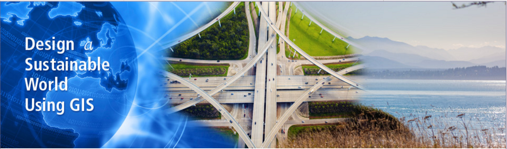
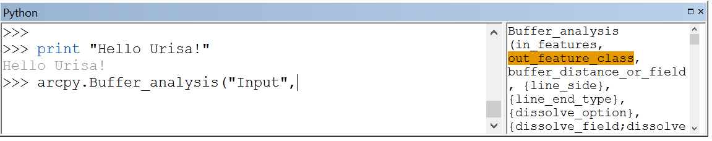
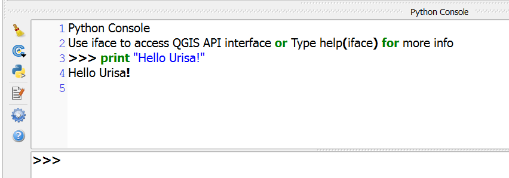
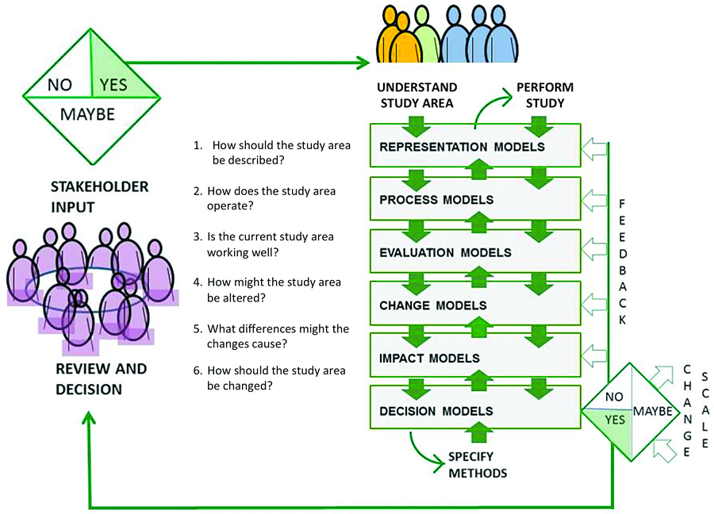

# Teaching GIS Programming

## A Sustainability Management Perspective

By Christy Heaton


## Master of Geographic Information Systems

## at the University of Washington





## Two year professional Program


## Online*

_*With three intensive on-site sessions_<!-- .element: class="fragment" data-fragment-index="0" -->


## With a Sustainability Management Focus


## Year One: Core Courses

_GIS Problem Solving_<!-- .element: class="fragment" data-fragment-index="0" -->

_GIS Data Management_<!-- .element: class="fragment" data-fragment-index="1" -->

_Principles of GIS Mapping_<!-- .element: class="fragment" data-fragment-index="2" -->

_Geospatial Data Analysis_<!-- .element: class="fragment" data-fragment-index="3" -->

_GIS Programming_<!-- .element: class="fragment" data-fragment-index="4" -->


## Year Two: Concentration Courses

_Coastal GIS_<!-- .element: class="fragment" data-fragment-index="0" -->

_GIS and Decision Support_<!-- .element: class="fragment" data-fragment-index="1" -->

_International Case Studies of GIS for Sustainability Management_<!-- .element: class="fragment" data-fragment-index="2" -->

_GIS Workshop_<!-- .element: class="fragment" data-fragment-index="3" -->


## GIS Programming

```python
import arcpy
from arcpy import #!/usr/bin/env python

#allow overwriting
env.overwriteOutput = True

#set workspace
env.workspace = r'C:/EsriPress/Python/Data'
```


# Why Python?

_Free and open source_<!-- .element: class="fragment" data-fragment-index="0" -->

_Relatively easy to learn_<!-- .element: class="fragment" data-fragment-index="1" -->

_Highly portable between different Operating Systems and architectures_<!-- .element: class="fragment" data-fragment-index="2" -->

_Built in to most major GIS Software producers to interface with their applications_<!-- .element: class="fragment" data-fragment-index="3" -->


## ArcGIS

_Field calculator_<!-- .element: class="fragment" data-fragment-index="0" -->

_Labels_<!-- .element: class="fragment" data-fragment-index="1" -->

_Python window_<!-- .element: class="fragment" data-fragment-index="2" -->

_Create your own tools in ArcToolbox_<!-- .element: class="fragment" data-fragment-index="3" -->


## ArcGIS




## QGIS

_Python window_<!-- .element: class="fragment" data-fragment-index="0" -->

_Python modules_<!-- .element: class="fragment" data-fragment-index="1" -->


## QGIS




# Sustainability Management


## Focus on the Environment

_Needs of the Present_<!-- .element: class="fragment" data-fragment-index="0" -->

_Future Generations_<!-- .element: class="fragment" data-fragment-index="1" -->

_The Economy_<!-- .element: class="fragment" data-fragment-index="2" -->


## Project Management

_Initiating, planning, executing, controlling, and closing the work of a team to achieve specific goals and meet specific success criteria_<!-- .element: class="fragment" data-fragment-index="0" -->


## Steinitz Geodesign Framework

_A methodology that provides a design framework and supporting technology to leverage geographic information, resulting in designs that more closely follow natural systems._<!-- .element: class="fragment" data-fragment-index="0" -->


## Key questions used to refine the Geodesign process:

_1. How should the study area be described?_<!-- .element: class="fragment" data-fragment-index="0" -->

_2. How does the study area function?_<!-- .element: class="fragment" data-fragment-index="1" -->

_3. Is the current study area working well?_<!-- .element: class="fragment" data-fragment-index="2" -->

_4. How might the study area be altered?_<!-- .element: class="fragment" data-fragment-index="3" -->

_5. What difference might the changes cause?_<!-- .element: class="fragment" data-fragment-index="4" -->

_6. How should the study area be changed?_<!-- .element: class="fragment" data-fragment-index="5" -->





## How we do it

_Guest Lectures_<!-- .element: class="fragment" data-fragment-index="0" -->

_Assignments_<!-- .element: class="fragment" data-fragment-index="1" -->

_Discussions_<!-- .element: class="fragment" data-fragment-index="2" -->

_Final Projects_<!-- .element: class="fragment" data-fragment-index="3" -->


## Example: Tansy Ragweed


# Questions?


# Thank you!
