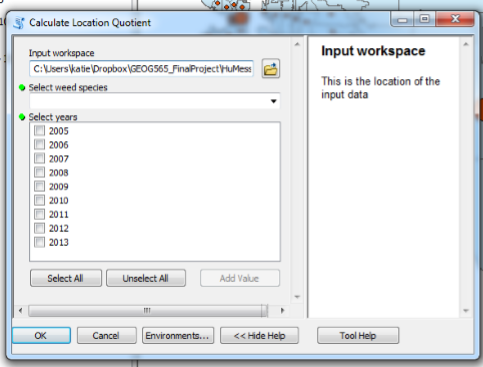

# Teaching GIS

## A Sustainability Management Perspective


# Master of Geographic Information Systems

## at the University of Washington


## Two year professional Program


## Online

With three intensive on-site sessions


## With a Sustainability Management Focus


# Sustainability Management


## Focus on the Environment

_Needs of the Present_<!-- .element: class="fragment" data-fragment-index="0" -->

_Future Generations_<!-- .element: class="fragment" data-fragment-index="1" -->

_The Economy_<!-- .element: class="fragment" data-fragment-index="2" -->


## Project Management

_Initiating, planning, executing, controlling, and closing the work of a team to achieve specific goals and meet specific success criteria_<!-- .element: class="fragment" data-fragment-index="0" -->


# Curriculum


## Year One: Core Courses

_GIS Problem Solving_<!-- .element: class="fragment" data-fragment-index="0" -->

_GIS Data Management_<!-- .element: class="fragment" data-fragment-index="1" -->

_Principles of GIS Mapping_<!-- .element: class="fragment" data-fragment-index="2" -->

_Geospatial Data Analysis_<!-- .element: class="fragment" data-fragment-index="3" -->

_GIS Programming_<!-- .element: class="fragment" data-fragment-index="4" -->


## Year Two: Concentration Courses

_Coastal GIS_<!-- .element: class="fragment" data-fragment-index="0" -->

_GIS and Decision Support_<!-- .element: class="fragment" data-fragment-index="1" -->

_International Case Studies_<!-- .element: class="fragment" data-fragment-index="2" -->

_GIS Workshop_<!-- .element: class="fragment" data-fragment-index="3" -->


# GIS Programming

```python
import arcpy
from arcpy import #!/usr/bin/env python

#allow overwriting
env.overwriteOutput = True

#set workspace
env.workspace = r'C:/EsriPress/Python/Data'
```


## Why Python?

_Free and open source_<!-- .element: class="fragment" data-fragment-index="0" -->

_Relatively easy to learn_<!-- .element: class="fragment" data-fragment-index="1" -->

_Highly portable between different Operating Systems and architectures_<!-- .element: class="fragment" data-fragment-index="2" -->

_Built in to most major GIS Software producers to interface with their applications_<!-- .element: class="fragment" data-fragment-index="3" -->


## ArcGIS

_Field calculator_<!-- .element: class="fragment" data-fragment-index="0" -->

_Labels_<!-- .element: class="fragment" data-fragment-index="1" -->

_Python window_<!-- .element: class="fragment" data-fragment-index="2" -->

_Create your own tools in ArcToolbox_<!-- .element: class="fragment" data-fragment-index="3" -->


## ArcGIS


## QGIS

_Python window_<!-- .element: class="fragment" data-fragment-index="0" -->

_Python modules_<!-- .element: class="fragment" data-fragment-index="1" -->


## QGIS


# How we do it


## Steinitz Geodesign Framework

_A methodology that provides a design framework and supporting technology to leverage geographic information, resulting in designs that more closely follow natural systems._<!-- .element: class="fragment" data-fragment-index="0" -->

_GIS_<!-- .element: class="fragment" data-fragment-index="1" -->

_Urban Planning_<!-- .element: class="fragment" data-fragment-index="2" -->

_Natural Systems_<!-- .element: class="fragment" data-fragment-index="3" -->


## Key questions used to refine the Geodesign process:

_1. How should the study area be described?_<!-- .element: class="fragment" data-fragment-index="0" -->

_2. How does the study area function?_<!-- .element: class="fragment" data-fragment-index="1" -->

_3. Is the current study area working well?_<!-- .element: class="fragment" data-fragment-index="2" -->

_4. How might the study area be altered?_<!-- .element: class="fragment" data-fragment-index="3" -->

_5. What difference might the changes cause?_<!-- .element: class="fragment" data-fragment-index="4" -->

_6. How should the study area be changed?_<!-- .element: class="fragment" data-fragment-index="5" -->


## Guest Lectures

__<!-- .element: class="fragment" data-fragment-index="0" -->


## Assignments

__<!-- .element: class="fragment" data-fragment-index="0" -->


## Discussions

_Raspberry Pi_<!-- .element: class="fragment" data-fragment-index="0" -->

_R_<!-- .element: class="fragment" data-fragment-index="1" -->

_NumPy and SciPy Modules_<!-- .element: class="fragment" data-fragment-index="2" -->


## Final Projects

_Use a project from a previous course and Python-ize it_<!-- .element: class="fragment" data-fragment-index="0" -->

_Build ArcGIS Tools_<!-- .element: class="fragment" data-fragment-index="1" -->

_Focus on the Environment_<!-- .element: class="fragment" data-fragment-index="2" -->


# Example: Location Quotient of Tansy Ragwort


Source: [Oregon State University](http://oregonstate.edu/dept/nursery-weeds/weedspeciespage/tansy_ragwort/flower_250.jpg)


## Tansy Ragwort

_Invasive biennial weed from Europe most often found in pastures and along roads and trails_<!-- .element: class="fragment" data-fragment-index="0" -->

_Toxic to animals_<!-- .element: class="fragment" data-fragment-index="1" -->

_Widespread in the Pacific Northwest_<!-- .element: class="fragment" data-fragment-index="2" -->

_Source: [King County](http://www.kingcounty.gov/environment/animals-and-plants/noxious-weeds/weed-identification/tansy-ragwort.aspx)_<!-- .element: class="fragment" data-fragment-index="3" -->


## Location Quotient

_Analytical Statistic_<!-- .element: class="fragment" data-fragment-index="0" -->

_Quantifies how concentrated a particular group is in a region as compared to the whole_<!-- .element: class="fragment" data-fragment-index="1" -->

_Useful for determining what makes regions "unique"_<!-- .element: class="fragment" data-fragment-index="2" -->


## Steps for previous project

_Create a subset of all tansy ragwort data between the years of 2005 and 2013_<!-- .element: class="fragment" data-fragment-index="0" -->

_Conduct a spatial join between the weed data and Zip Codes_<!-- .element: class="fragment" data-fragment-index="1" -->

_Calculate the location quotients for each year by Zip Code_<!-- .element: class="fragment" data-fragment-index="2" -->

_Join the resulting tables to Zip Codes_<!-- .element: class="fragment" data-fragment-index="3" -->

_Create a map for each year_<!-- .element: class="fragment" data-fragment-index="4" -->


## Tool




## Tool


## Final Map


# Questions?


# Thank you!

Contact: heatonc@uw.edu

[christyheaton.github.io](christyheaton.github.io)
